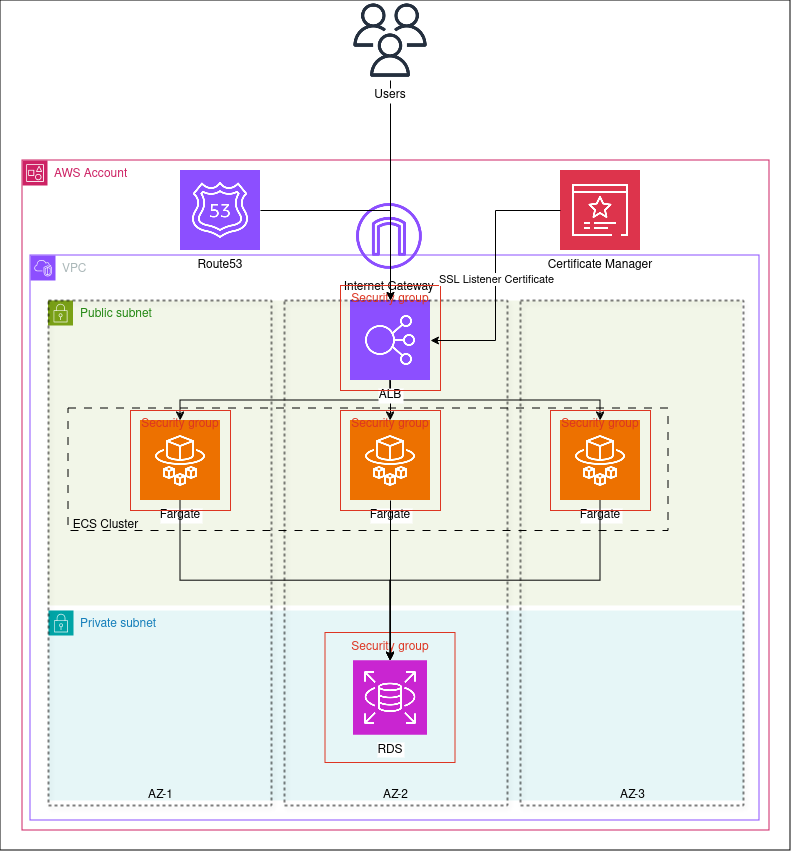

# LAMP

This project is a LAMP stack , a two-tier applicaion deplyed in different ways. 

Check-out my youtube video for more information : [Youtube](https://www.youtube.com/watch?v=8g5dg3ffGOc)

## Architecture


## Deployment Types

### 1. My old ec2 way with user-data
I have made a Cloudformation script that deploys phpmyadmin and configures it on an ec2 instance. 
Note: It is not updated ,because it uses launch configuration ,all you need to change is to create a launch template instead.

### 2. My old terraform
I have made a terraform script that deploys phpmyadmin and configures it on an ec2 instance.\
It is already updated to use launch template. So it is ready to use.

### 3. Docker compose 
You can deploy phpmyadmin using docker containers, there are prebuild images for phpmyadmin and mysql.\
So you can replicate it on your own machine.
```bash
docker compose up -d

# Open localhost:8080 in your browser
# Username : root , and password : example , host : mysql-database
```

### 4. New Architecture
I have made a new deployment using terraform and deployed it on ECS Fargate.\
It is a two-tier application with a load balancer and a database on RDS.\
```bash
cd terraform_new

terraform init
terraform apply

```
